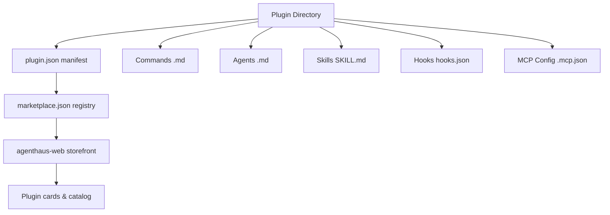

# Architecture Overview

Persistent context for AI agents working in this repository. Read this file before starting large tasks.

## Repository Purpose

AgentHaus Marketplace is a collection of **23 production-ready plugins** for Claude Code and Claude Cowork. It includes a Next.js web storefront for browsing and discovering plugins.

## High-Level Structure

```text
agenthaus-marketplace/
├── agenthaus-web/          # Next.js 16 storefront (frontend)
├── plugins/                # 23 plugin directories (the product)
├── .agent/                 # Agent configuration (rules, skills, workflows, memory-bank)
├── .claude-plugin/         # Marketplace registry (marketplace.json)
├── schemas/                # JSON schemas for validation
├── scripts/                # Automation scripts (validate-plugins.sh)
├── reports/                # Project reports and documentation
└── AGENTS.md               # Universal AI assistant instructions (symlinked)
```

## Component Relationships



## Plugin Anatomy

Each plugin lives in `plugins/<name>/` and follows this structure:

| Component | Path | Format | Required |
|-----------|------|--------|----------|
| Manifest | `.claude-plugin/plugin.json` | JSON | Yes |
| README | `README.md` | Markdown | Yes |
| Commands | `commands/*.md` | Markdown + YAML frontmatter | No |
| Agents | `agents/*.md` | Markdown + YAML frontmatter | No |
| Skills | `skills/<name>/SKILL.md` | Markdown + YAML frontmatter | No |
| Hooks | `hooks/hooks.json` | JSON (object with `hooks` key) | No |
| MCP Config | `.mcp.json` | JSON with `mcpServers` | No |

## Data Flow

1. **Plugin creation** → Files in `plugins/<name>/`
2. **Validation** → `scripts/validate-plugins.sh` checks structure + JSON
3. **Registration** → Entry added to `.claude-plugin/marketplace.json`
4. **Storefront** → `agenthaus-web/` reads plugin data and renders catalog
5. **Installation** → End users install via `/plugin install <name>`

## Web Storefront Stack

- **Framework:** Next.js 16.0.0 (App Router, React 19)
- **Styling:** Tailwind CSS 4.0.0
- **Database:** Neon Serverless Postgres
- **Icons:** Lucide React
- **Deployment:** Requires `DATABASE_URL` env var

## CI/CD Pipeline

GitHub Actions (`.github/workflows/validate.yml`):

1. **validate-plugins** — Runs `validate-plugins.sh` against all plugins
2. **validate-json** — Checks JSON syntax of marketplace.json, all plugin.json, .mcp.json, hooks.json
3. **lint-web** — Installs, lints, and builds the web storefront

## Plugin Categories

`content` · `devops` · `cloud` · `deployment` · `knowledge` · `docs` · `rag` · `productivity` · `qa` · `testing` · `database` · `utility` · `ux` · `orchestration` · `safety` · `memory` · `training` · `security` · `integration`
