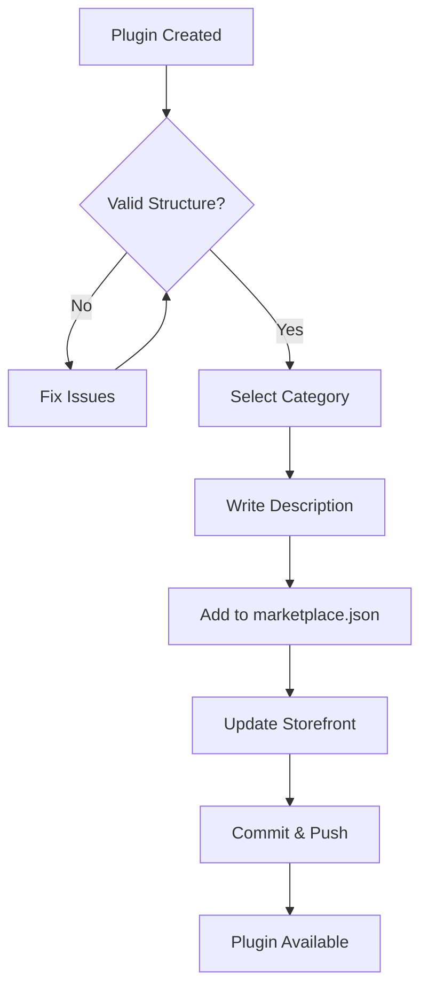

# Marketplace Registration Reference

This document provides detailed guidance for registering plugins with the AgentHaus marketplace.

## Registration Workflow



## marketplace.json Location

The marketplace registry is located at:

```text
.claude-plugin/marketplace.json
```

## Plugin Entry Format

Each plugin in the registry requires:

```json
{
  "name": "plugin-name",
  "source": "./plugins/plugin-name",
  "category": "category-name",
  "description": "User-facing description."
}
```

## Category Guidelines

Choose the most specific applicable category:

| Category       | Use When Plugin...                         |
| -------------- | ------------------------------------------ |
| `devops`       | Manages deployments, CI/CD, infrastructure |
| `productivity` | Handles tasks, calendars, notifications    |
| `content`      | Creates social posts, articles, marketing  |
| `qa`           | Runs tests, validates quality              |
| `docs`         | Retrieves or manages documentation         |
| `cloud`        | Integrates with cloud providers            |
| `database`     | Manages database operations                |
| `rag`          | Implements RAG patterns                    |
| `knowledge`    | Works with wikis, notes, knowledge bases   |
| `utility`      | General-purpose tools                      |

## Description Best Practices

**Good descriptions:**

- Start with an action verb
- Mention key capabilities
- Keep under 150 characters

**Examples:**

- ✅ "Manage GitHub issues and PRs through custom commands and MCP."
- ✅ "Generate high-engagement social posts with trend analysis."
- ❌ "A plugin that uses the GitHub MCP server to do stuff." (too vague)
- ❌ "github-integration plugin" (just repeats the name)

## Web Storefront Updates

If the marketplace has a web storefront (`agenthaus-web/`), update:

1. **Plugin Catalog**: Add plugin metadata to the catalog
2. **Category Page**: Ensure plugin appears under correct category
3. **Search Index**: Update search metadata if applicable

## Installation Command

After registration, users can install via:

```bash
# Add marketplace (if not already added)
/plugin marketplace add https://github.com/savethepolarbears/agenthaus-marketplace

# Install specific plugin
/plugin install <plugin-name>@AgentHaus
```

## Versioning

When updating an existing plugin:

1. Bump version in `plugin.json`
2. Update description in `marketplace.json` if functionality changed
3. Document changes in plugin's README.md
